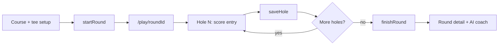

# On-Course Play — Implementation Plan

Live hole-by-hole scoring on the course with map view and distance. Work through **one sub-phase at a time**; each phase has clear scope, files, and acceptance criteria so an agent can pick up where the last one left off.

**How to use with an agent:**  
> Read `docs/ON_COURSE_PLAY.md` and implement **Phase 6a** only. Do not start 6b until 6a is done and verified.

Update the status column in this file (and `docs/ROADMAP.md`) when a phase is complete.

## Status legend

- ✅ Done
- 🚧 In progress
- ⬜ Not started

---

## Current state (already built)

| Piece | Location | Notes |
|-------|----------|-------|
| Hole-by-hole capture UI | `components/AddRoundForm.tsx` | Score, putts, OTT, GIR, APP, ARG; steps: setup → holes → review |
| Hole navigation | `components/HoleNavBar.tsx`, `components/HolePicker.tsx` | Fixed bottom bar, jump-to-hole |
| Course search + tee data | `components/CourseSearch.tsx`, `app/api/courses/` | Par & yardage via golfcourseapi.com |
| Round save (end of session) | `app/actions.ts` → `createRound` | Saves full round in one transaction at review |
| Round edit | `app/rounds/[id]/edit/page.tsx` → `updateRound` | Replaces all holes on submit |
| Data model | `prisma/schema.prisma` | `Round` + `Hole`; rich stats per hole |
| Aggregates & SG | `lib/golf-logic/aggregate.ts`, `strokes-gained.ts` | Recompute on save |
| PWA | `public/manifest.json`, `components/PwaProvider.tsx` | Install prompt, service worker |
| Validation | `lib/types/golf.ts` | Zod schemas, `HoleInput`, `emptyHole()` |

## Gaps (what this plan adds)

1. **No in-progress rounds** — `createRound` only runs after the full round is entered.
2. **No per-hole save** — cannot save hole 3 and come back later.
3. **No dedicated play route** — entry lives embedded on the dashboard (`app/page.tsx`).
4. **No map or GPS** — golfcourseapi.com gives course-level lat/lng and hole yardage, not per-hole tee/green GPS.
5. **No offline queue** — requires network for every action.

---

## Architecture overview



**Key design decisions**

- **Separate “play now” from “log after the fact.”** Keep `AddRoundForm` + `createRound` for post-round logging. Add `startRound` / `saveHole` / `finishRound` for live play.
- **Incremental persistence.** Each hole upserts immediately; round aggregates update after every save.
- **Reuse existing UI.** Extract hole entry from `AddRoundForm` rather than rewriting forms.
- **Map/GPS is phased.** Phase 6a works with zero map code; distance features come in 6c–6f.

---

## Phase 6a — Live play mode (start here) ✅

**Goal:** Start a round on the course, enter scores hole-by-hole, save after each hole, finish when done.

**Depends on:** Nothing (first phase).

### Schema

Add to `prisma/schema.prisma`:

```prisma
enum RoundStatus {
  IN_PROGRESS
  COMPLETED
}

model Round {
  // ...existing fields
  status RoundStatus @default(COMPLETED)
}
```

- Run migration. Existing rounds remain `COMPLETED` via default.
- Holes for in-progress rounds: create stubs at `startRound` with `par`, `yardage`, and sensible defaults from `emptyHole()` (same as `CourseSearch.teeHolesToInputs`).

### Server actions — `app/actions/play.ts`

| Action | Purpose |
|--------|---------|
| `startRound(formData)` | Create `Round` with `status: IN_PROGRESS`, create hole stubs, return `roundId` |
| `saveHole(roundId, holeNumber, holeData)` | Upsert one hole; verify ownership; recompute aggregates on `Round` |
| `finishRound(roundId)` | Set `status: COMPLETED`; `revalidatePath` dashboard + round detail |

**Rules**

- All actions: `getDbUser()` + verify `round.userId === dbUser.id`.
- `saveHole`: validate with existing Zod hole schema from `lib/types/golf.ts`.
- `finishRound`: only allowed when `status === IN_PROGRESS`; optionally require all holes have been touched (or allow partial — document choice in code).
- Do **not** delete-and-recreate all holes on each save (unlike `updateRound` today).

### Routes & UI

| File | Purpose |
|------|---------|
| `app/play/[roundId]/page.tsx` | Server component: load round + holes; redirect if not owner or already completed |
| `components/PlayRoundClient.tsx` | Client shell: current hole state, calls `saveHole`, uses `HoleNavBar` |
| `components/HoleScoreCard.tsx` | Extract hole entry fields from `AddRoundForm` (score, putts, penalties, OTT, GIR, APP, ARG) |

**Setup entry point**

- On dashboard setup step (or new “Play now” button): call `startRound` instead of going to inline hole entry when user chooses live play.
- Minimal approach for 6a: add **“Start round on course”** button on setup that calls `startRound` and `router.push(/play/${id})`.

### Dashboard

| File | Purpose |
|------|---------|
| `components/ResumeRoundBanner.tsx` | Show in-progress round with “Resume” → `/play/[id]` |

Query: `rounds where status = IN_PROGRESS` for current user on `app/page.tsx`.

### Acceptance criteria

- [x] User selects course + tee, taps “Start round on course”, lands on `/play/[roundId]`.
- [x] Entering hole 1 data and tapping Next persists to DB (verify in Prisma / round detail).
- [x] Refreshing `/play/[roundId]` restores current hole and saved data.
- [x] Dashboard shows “Resume round” for in-progress round.
- [x] “Finish round” sets `COMPLETED`; round appears in recent rounds with correct totals.
- [x] Post-round `AddRoundForm` flow still works unchanged.
- [x] Unauthorized users cannot access another user’s play session.

### Out of scope for 6a

- Map, GPS, offline queue
- Simplifying the hole form (full stats remain)
- AI coach auto-trigger on finish (optional nice-to-have)

---

## Phase 6b — Play UI polish ✅

**Goal:** Full-screen on-course experience with running totals and cleaner layout.

**Depends on:** Phase 6a ✅

### Tasks

| Task | Notes |
|------|-------|
| Play layout | Hide dashboard clutter; optional minimal header (hole, running score) |
| Running totals sticky header | `totalScore`, `greensInReg`, `fairwaysHit`, `totalPutts` vs par |
| Auto-advance | After successful `saveHole`, move to next hole |
| `HoleScoreCard` refinement | Large tap targets; consider collapsible “More stats” for OTT/APP/ARG |
| Loading / error states | Toast or inline message if `saveHole` fails |
| `manifest.json` `start_url` | Consider `/` or document that PWA opens dashboard with resume banner |

### Files

- `components/PlayRoundClient.tsx` — header, layout
- `components/PlayRoundHeader.tsx` — running totals (new)
- `app/play/[roundId]/page.tsx` — full-screen wrapper, `pb` for `HoleNavBar`

### Acceptance criteria

- [x] Play screen feels like a dedicated app view, not a form embedded in the dashboard.
- [x] Running score visible while entering any hole.
- [x] Saving a hole auto-advances to the next (with manual back still available).
- [x] Works on mobile viewport (375px); bottom nav not obscured by browser chrome (safe areas).

**PWA note:** `manifest.json` `start_url` remains `/` so installed apps land on the dashboard with the resume banner for in-progress rounds.

### Out of scope

- Map, GPS, offline

---

## Phase 6c — GPS hook + distance display ✅

**Goal:** Show distance on the play screen using phone GPS and/or static hole yardage.

**Depends on:** Phase 6b ✅

### Tier A (this phase) — no paid GPS API

| Task | Notes |
|------|-------|
| `hooks/useGeolocation.ts` | `watchPosition`, high accuracy, permission handling, error states |
| `lib/golf-logic/distance.ts` | Haversine: meters → yards |
| Distance display on play screen | Primary: `hole.yardage` from tee data; when GPS available: distance to course center lat/lng from course API `location` |
| Persist course lat/lng on round | Optional: `Round.courseLatitude`, `courseLongitude` at `startRound` from course detail API |

**Note:** Course-center distance is **not** hole-accurate. Label UI honestly (e.g. “~X yds to course center” vs “Hole yardage: Y”).

### Files

- `hooks/useGeolocation.ts`
- `lib/golf-logic/distance.ts`
- `components/DistanceReadout.tsx`
- Wire into `PlayRoundClient.tsx`

### Acceptance criteria

- [x] Play screen shows hole yardage from tee data.
- [x] With location permission, shows live distance readout (course center or labeled approximation).
- [x] Graceful fallback when GPS denied or unavailable.
- [x] No new paid API dependencies.

---

## Phase 6d — Map view ✅

**Goal:** Visual map on the play screen with player position and course context.

**Depends on:** Phase 6c ✅

### Tasks

| Task | Notes |
|------|-------|
| Choose map library | **Leaflet** + OpenStreetMap (free, no API key) — chosen for 6d |
| `components/PlayMap.tsx` | Map pane ~40% height; player dot from `useGeolocation` |
| Course marker | Plot course center from stored lat/lng |
| Play layout split | Map top, score entry bottom sheet / scrollable panel |

### Env (if Mapbox)

```
NEXT_PUBLIC_MAPBOX_TOKEN=...
```

Document in `.env.example` if added.

### Acceptance criteria

- [x] Map renders on `/play/[roundId]` on mobile and desktop.
- [x] Player position updates on the map when GPS available.
- [x] Score entry remains usable below/alongside map.
- [x] Map does not block hole navigation or save actions.

### Out of scope

- Hole polygon overlays, hazard maps (requires paid GPS data — Phase 6f)

---

## Phase 6e — Offline hole queue ✅

**Goal:** Continue entering scores with weak or no cell signal; sync when back online.

**Depends on:** Phase 6a ✅ (can parallelize after 6a; does not require 6d)

### Tasks

| Task | Notes |
|------|-------|
| IndexedDB queue | Pending `saveHole` payloads per `roundId` + `holeNumber` |
| Optimistic UI | Update local state immediately; mark holes “pending sync” |
| Sync on `online` event | Flush queue via `saveHole`; handle conflicts (server wins or last-write-wins — document choice) |
| Service worker | Extend `public/sw.js` if needed for app shell caching (optional) |

### Files

- `lib/offline/hole-queue.ts`
- `hooks/useHoleSync.ts`
- Updates to `PlayRoundClient.tsx`

### Acceptance criteria

- [x] Enter hole data in airplane mode; data retained in UI.
- [x] On reconnect, queued holes sync to server without user action.
- [x] User sees sync status (pending / synced / failed).
- [x] No duplicate holes after sync (idempotent `saveHole`).

**Conflict policy:** last-write-wins on the client; `saveHole` upserts by `roundId` + `holeNumber`.

---

## Phase 6f — Hole-level GPS data ✅

**Goal:** True distance to green (F/C/B pin positions), not course-center approximation.

**Depends on:** Phase 6d ✅ (recommended)

### Provider architecture (free now, paid later)

Hole GPS is resolved through a **pluggable provider stack** in `lib/golf-course-gps/`:

| Priority | Provider | Env | Notes |
|----------|----------|-----|-------|
| 1 (cache) | `CourseGpsCache` DB | — | All sources cached; **manual calibrations are never auto-overwritten** |
| 2 | Paid | `GOLF_GPS_PROVIDER`, `GOLF_GPS_API_KEY` | Stub in `providers/paid.ts` — wire iGolf / Golfbert / Golf Intelligence when keys exist |
| 3 | OpenStreetMap | — | Free Overpass API (`golf=hole`, `golf=tee`, `golf=green`) |
| 4 | Manual calibration | — | On-course “Mark tee / Mark green” UI; ideal for home courses (e.g. Club de golf Algonquin, Messines QC) |

[golfcourseapi.com](https://golfcourseapi.com) still does **not** provide per-hole coordinates. Paid options for production-scale coverage:

- [iGolf Connect](https://igolf.com/solutions/golf-course-data/)
- [Golf Intelligence](https://golfintelligence.com/golf-course-database/)
- [Golfbert](https://golfbert.com/api)

To add a paid provider later: implement `fetchFromPaidProvider` in `lib/golf-course-gps/providers/paid.ts` — the resolver and cache layer stay unchanged.

### Tasks

| Task | Notes |
|------|-------|
| Provider integration | `lib/golf-course-gps/` + `providers/osm.ts`, `providers/paid.ts` |
| Cache table | `CourseGpsCache` keyed by `gca:{id}` or `geo:{lat},{lng}:{name}` |
| `lib/golf-logic/distance.ts` | `distancesToGreen()` for F/C/B |
| Map overlays | Tee + green F/C/B markers; map fits current hole |
| Manual calibration | `components/CourseGpsCalibration.tsx` on play screen |
| Server actions | `app/actions/course-gps.ts` |

### Schema

```prisma
model CourseGpsCache {
  id               String   @id @default(cuid())
  cacheKey         String   @unique
  externalCourseId Int?
  courseName       String?
  payload          Json     // holes[].tee, green.f/c/b lat/lng
  source           String   // osm | manual | igolf | golfbert | ...
  fetchedAt        DateTime @default(now())
  updatedAt        DateTime @updatedAt
}
```

### Calibrating a home course (Algonquin example)

1. Start a live round at **Club de golf Algonquin** (Messines, QC).
2. On the play screen, tap **Calibrate on course** (or **Load from OSM** first if OSM has data).
3. At each tee: **Mark tee here**. At the green: **Mark green center** (optional front/back).
4. Save after ≥9 holes. Data is cached for all future rounds at that course.

### Acceptance criteria

- [x] Distance to green updates per hole using cached GPS data.
- [x] Map shows tee and green for current hole.
- [x] GPS data cached; repeat visits do not re-hit provider API every round.
- [x] Clear degradation when course has no GPS data in provider.

---

## File index (all phases)

| Path | Phase | Role |
|------|-------|------|
| `prisma/schema.prisma` | 6a | `RoundStatus`, optional lat/lng on Round |
| `app/actions/play.ts` | 6a | `startRound`, `saveHole`, `finishRound` |
| `app/play/[roundId]/page.tsx` | 6a | Live play route |
| `components/PlayRoundClient.tsx` | 6a | Client play shell |
| `components/HoleScoreCard.tsx` | 6a | Extracted hole entry form |
| `components/ResumeRoundBanner.tsx` | 6a | Dashboard resume CTA |
| `components/PlayRoundHeader.tsx` | 6b | Running totals |
| `hooks/useGeolocation.ts` | 6c | Browser GPS |
| `lib/golf-logic/distance.ts` | 6c | Haversine |
| `components/DistanceReadout.tsx` | 6c | Yardage + GPS display |
| `components/PlayMap.tsx` | 6d | Map component |
| `lib/offline/hole-queue.ts` | 6e | IndexedDB sync queue |
| `hooks/useHoleSync.ts` | 6e | Online/offline sync |
| `lib/golf-course-gps/` | 6f | Provider stack (OSM + paid stub + cache) |
| `app/actions/course-gps.ts` | 6f | Fetch / save hole GPS |
| `components/CourseGpsCalibration.tsx` | 6f | On-course manual pins |
| `model CourseGpsCache` | 6f | Persist hole GPS |

## Reuse — do not reinvent

| Existing | Reuse for |
|----------|-----------|
| `HoleNavBar`, `HolePicker` | Play navigation |
| `ToggleGroup`, `ToggleYesNo` pattern in `AddRoundForm` | OTT / GIR / APP / ARG |
| `emptyHole()`, `createRoundSchema`, `normalizeHoles` | Validation |
| `computeRoundAggregates()` | After each `saveHole` |
| `teeHolesToInputs()` in `CourseSearch.tsx` | Seed holes at `startRound` |
| `getDbUser()` in `lib/auth.ts` | All play actions |

## Testing checklist (manual, on phone)

1. Install PWA (Add to Home Screen).
2. Start round with real course + tee from search.
3. Play 2–3 holes with spotty signal (if 6e: airplane mode test).
4. Kill browser tab, reopen — resume works.
5. Finish round — dashboard totals and round detail correct.
6. Run AI coach on completed round — still works.

## Suggested agent prompts

**Phase 6a**
> Implement Phase 6a from `docs/ON_COURSE_PLAY.md`: in-progress rounds, `app/actions/play.ts`, `/play/[roundId]`, extract `HoleScoreCard`, resume banner. Do not add map or GPS.

**Phase 6b**
> Phase 6a is done. Implement Phase 6b from `docs/ON_COURSE_PLAY.md`: play UI polish, running totals header, auto-advance after save.

**Phase 6c**
> Implement Phase 6c from `docs/ON_COURSE_PLAY.md`: `useGeolocation`, distance readout, haversine helper. No map library yet.

**Phase 6d**
> Implement Phase 6d from `docs/ON_COURSE_PLAY.md`: add `PlayMap` with Leaflet or Mapbox, split play layout.

**Phase 6e**
> Implement Phase 6e from `docs/ON_COURSE_PLAY.md`: IndexedDB offline queue for `saveHole`.

**Phase 6f**
> Implement Phase 6f from `docs/ON_COURSE_PLAY.md`: integrate paid hole GPS provider and cache. Discuss provider choice if env key not set.

---

## Phase status tracker

| Phase | Goal | Status |
|-------|------|--------|
| 6a | Live play mode | ✅ |
| 6b | Play UI polish | ✅ |
| 6c | GPS + distance display | ✅ |
| 6d | Map view | ✅ |
| 6e | Offline sync | ✅ |
| 6f | Hole-level GPS | ✅ |
